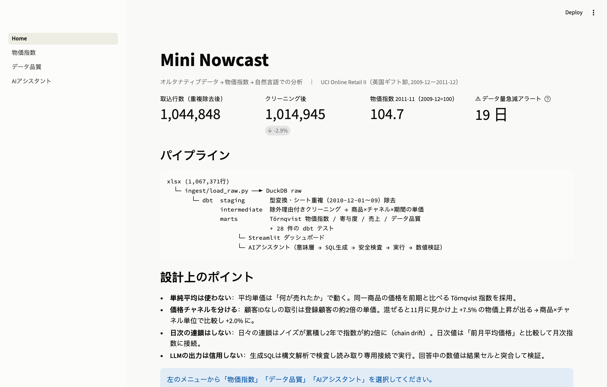
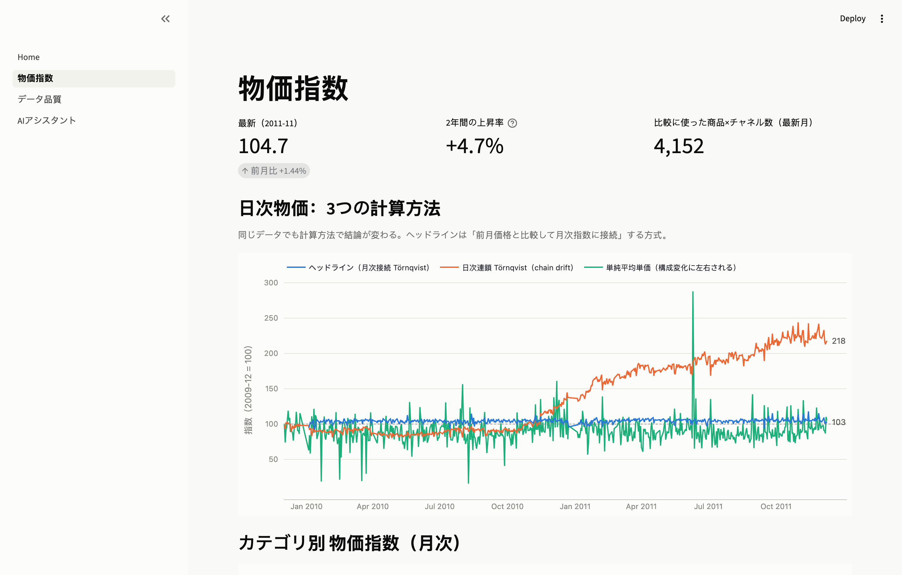
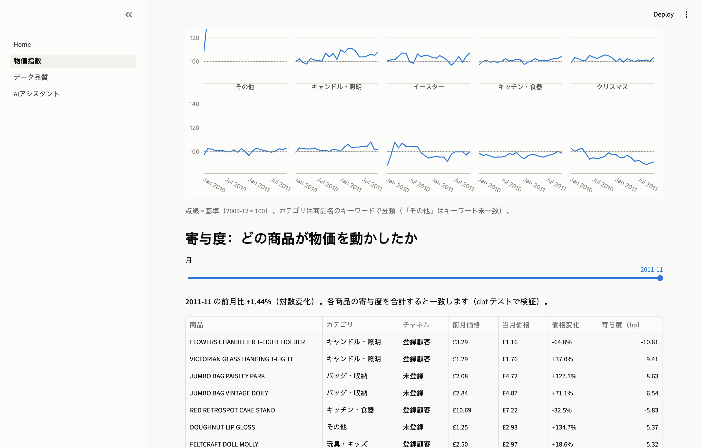
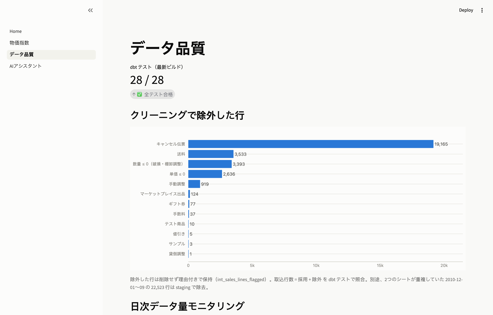
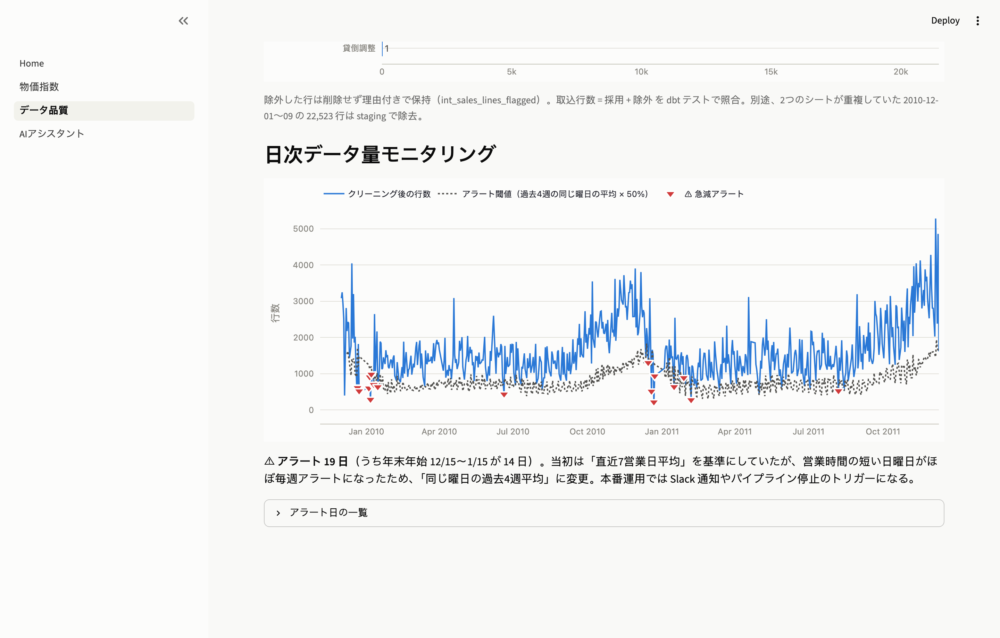
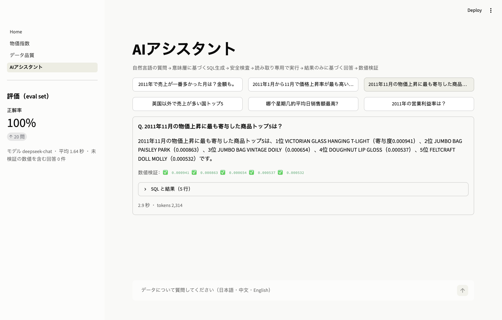

# Mini Nowcast

POS データから日次・月次の物価指数を作り、自然言語で分析できるようにする小さなデータ基盤です。
ナウキャストの「データサービス」（オルタナティブデータ → 指数）と「データ AI ソリューション」（LLM によるデータ活用）を、公開データで小さく再現しました。

- データ：[UCI Online Retail II](https://archive.ics.uci.edu/dataset/502/online+retail+ii)（英国のギフト卸, 2009-12〜2011-12, 1,067,371 行, CC BY 4.0）
- 技術：Python / DuckDB / dbt / Streamlit + 任意の OpenAI 互換 LLM API
- dbt の接続先を切り替えれば同じモデルを Snowflake でも実行できます（`dbt/profiles.yml` の `snowflake` target）



## 構成

```
xlsx ─► ingest/load_raw.py ─► DuckDB raw
          └─ dbt  staging       型変換・列名統一・シート間の重複週を除去
                  intermediate  除外理由付きクリーニング → 商品×価格チャネル×期間の単価
                  marts         物価指数（Törnqvist）/ 寄与度 / 売上 / データ品質   … 28 件のテスト
                       ├─ app/          Streamlit ダッシュボード（物価指数・データ品質）
                       └─ assistant/    自然言語 → SQL → 安全検査 → 実行 → 数値検証
```

## 実行方法

```bash
uv sync
make ingest      # xlsx → DuckDB（初回のみ約 2 分）
make build       # dbt seed + run + test
make test        # Python の単体テスト（ネットワーク不要）
make app         # http://localhost:8501
make eval        # AI アシスタントの評価（LLM API を使用）
make docs        # dbt のリネージ図
```

### LLM の設定（AI アシスタントを使う場合のみ）

`.env.example` を `.env` にコピーして 3 つの変数を設定します。**OpenAI 互換の API であれば何でも使えます**。

```bash
cp .env.example .env
```

```bash
LLM_API_KEY=sk-your-key-here
LLM_BASE_URL=https://api.deepseek.com
LLM_MODEL=deepseek-chat
```

| プロバイダ | `LLM_BASE_URL` | `LLM_MODEL` の例 |
|---|---|---|
| DeepSeek | `https://api.deepseek.com` | `deepseek-chat` |
| OpenAI | `https://api.openai.com/v1` | `gpt-4o-mini` |
| Moonshot（Kimi） | `https://api.moonshot.cn/v1` | `moonshot-v1-8k` |
| Qwen（DashScope） | `https://dashscope.aliyuncs.com/compatible-mode/v1` | `qwen-plus` |
| 智譜 GLM | `https://open.bigmodel.cn/api/paas/v4` | `glm-4-plus` |
| Groq | `https://api.groq.com/openai/v1` | `llama-3.3-70b-versatile` |
| OpenRouter | `https://openrouter.ai/api/v1` | `anthropic/claude-sonnet-4.5` |
| Ollama（ローカル） | `http://localhost:11434/v1` | `qwen2.5:14b` |

JSON モード（`response_format`）に対応していないプロバイダでは `LLM_JSON_MODE=off` を設定してください。
プロンプトで JSON を要求する方式に切り替わります。
以下の画面と評価結果は `deepseek-chat` で取得したものです。

（README のスクリーンショットは、アプリを起動した状態で
`uv run --with playwright python scripts/capture_screenshots.py` を実行すると再生成できます。）

## データを見て分かったこと・判断したこと

| 発見 | 対応 |
|---|---|
| 2 つのシートが 2010-12-01〜09 で重複（22,523 行） | staging で後のシートのみ採用。dbt テストで重複がないことを確認 |
| 同一シート内に完全一致の行が 23,430 行 | 同じ商品を 2 回スキャンした可能性があるため削除せず、合算して扱う |
| キャンセル・送料・手数料・テスト商品など | 削除せず「除外理由」を付けて保持。取込行数 = 採用 + 除外 をテストで照合 |
| **顧客 ID のない取引は同じ商品でも単価が約 2 倍** | 混ぜると 11 月に見かけ上 +7.5% の物価上昇が出る。「商品×価格チャネル」単位で比較し +2.0% に |
| **日次で連鎖すると指数が 2 年で約 2 倍に（chain drift）** | 日次値は「前月の平均価格」と比較して月次指数に接続。連鎖は月次のみ |
| 単純な平均単価は「何が売れたか」で大きく動く | 比較用に表示するのみ。ヘッドラインは Törnqvist 指数 |
| データ量アラートが日曜日ばかり出た | 基準を「直近 7 営業日平均」から「同じ曜日の過去 4 週平均」に変更 |

結果：物価指数は 2009-12 = 100 に対し 2011-11 に 104.7（2 年で +4.7%）。

### 計算方法の違いが結論を変える



同じデータでも、日々の変化を連鎖させると指数は 2 年で 218 まで膨らみます（オレンジ）。
単純平均単価（緑）は構成変化でこれだけ振れます。ヘッドライン（青）は前月価格と比較して月次指数に接続する方式です。

### どの商品が物価を動かしたか



月ごとの指数変化を商品×チャネル単位に分解します。寄与度の合計が指数の変化と一致することは dbt テストで検証しています。

### データ品質



除外した行は削除せず、理由を付けて保持しています（取込行数 = 採用 + 除外 をテストで照合）。



行数が「同じ曜日の過去 4 週平均」の半分を下回った日にアラート（赤い▼）。19 日のうち 14 日が年末年始に集中しています。

## AI アシスタントの設計



LLM の出力は「信用しない入力」として扱います。回答中の数値は結果セルと突合し、一致したものに ✅ を付けます。

1. **意味層**（`assistant/semantic_layer.yml`）：使ってよいテーブル・列の意味・集計できない列（`customers` など）を定義。実際の DB と一致するかをテストで検査
2. **SQL の安全検査**（`assistant/sql_guard.py`）：構文解析（sqlglot）で SELECT 1 文のみ許可。DDL/DML・`COPY`・`ATTACH`・`read_csv()` 等のファイル読み込み・許可外テーブルを拒否し、行数上限を付与
3. **読み取り専用で実行**：DuckDB を `read_only` + 外部ファイルアクセス無効で接続（二重の防御）
4. **自己修正**：検査や実行でエラーになったら、エラー内容を LLM に返して再生成（最大 3 回）
5. **数値検証**：回答に出てくる数値を LLM に列挙させ、結果セルの値（または差・比率）と突合。一致しない数値は ⚠ で表示
6. **答えられない質問は断る**：利益率・天気など、データにない質問には推測で答えない

### 評価（`make eval`）

| 指標 | 値 |
|---|---|
| 正解率（20 問：日本語・中文・English、うち 2 問は「断るべき質問」） | 20 / 20 |
| 未検証の数値を含む回答 | 0 |
| 平均応答時間 | 1.6 秒 |
| トークン数（20 問合計） | 約 38,000 |

評価用の SQL（正解）の結果に含まれる数値が、予測の結果にすべて含まれていれば正解としています。
20 問すべて正解なので、評価セットはまだ易しすぎます。次は、曖昧な質問や、集計できない列を足してしまう罠のある質問を増やす予定です。

## 限界と次のステップ

- **数量割引**：同じチャネル内でも購入数量で単価が変わる。数量帯ごとに分けるか、単価の中央値を使う方法を検討
- **カテゴリ分類**：キーワードで分類しているため約 4 割が「その他」。LLM で分類し、人が確認して seed に保存する流れにしたい
- **多国間比較法**：月次の連鎖にも多少のドリフトがあり得る。GEKS-Törnqvist などで検証したい
- **本番化**：Snowflake への移行、増分モデル、dbt テスト失敗時の通知、アシスタントのログ（`data/assistant_log.jsonl`）の監視
